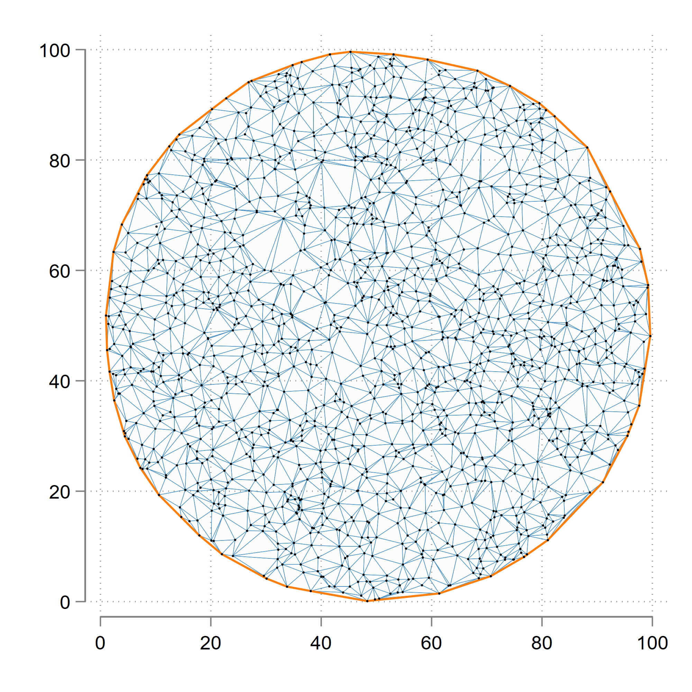

# Stata delaunay voronoi

Implementation of the S-Hull Delaunay triangulation algorithm in Stata. The algorithm also generates the convex hull. The Voronoi are recovered as a dual to the Delaunay.

*Note:* This is a beta release and still needs to be improved. It has been uploaded here for testing purposes only. Feedback is always welcome!


## Install the package:

Please install and replace the package everytime  you want to use it. Small tweaks are continuously being made. The following command can be used to install it directly in Stata:

```applescript
net install delaunay, from("https://raw.githubusercontent.com/asjadnaqvi/stata-delaunay-voronoi/main/installation/") force
```

The force option ensures that the files are replaced even if Stata thinks they are the same. For older versions see the `versions` folder. These are there to allow roll-back of stable releases.


The syntax is:

```applescript
delaunay x y, id(id) [triangles] [hull] [voronoi]
```

where `x` and `y` are coordinates. `id` is the serial identifier of each point. The last three options export the `triangles`, `hull`, and `voronoi` back to Stata for plotting.

See the help files for details:

```applescript
help delaunay
```

## Test the package:

You can use the above do file for test the code. A sample code is provided here:

Generate some random data or use your own coordinates:

```applescript
set obs 2000  // have tested up to 10k observations

gen x = runiform(0,100)
gen y = runiform(0,100)


// create a donut (if you want)
drop if sqrt((x-50)^2 + (y-50)^2) > 50

local obs = _N 
di `obs'
gen id = _n
order id

mat drop _all
```


Export everything back to Stata:

```applescript
delaunay x y, id(id) triangles hull voronoi
```

Plot the triangles and the hull:

```applescript
	twoway ///
		(area tri_y tri_x, cmissing(n) nodropbase fc(gs14%10) lw(0.04) lc()) ///
		(line hull_y hull_x) ///
		(scatter y x , msize(0.2) mc(black) ) ///
		, ///
		legend(off) aspect(1) xsize(1) ysize(1)
```




Plot the Voronoi tessellations:

```applescript
	twoway ///
		(pcspike vor_y1 vor_x1 vor_y2 vor_x2, lw(0.08) lc()) ///
		(scatter y x , msize(0.1) mc(black) ) ///
				, ///
		legend(off)	aspect(1) xsize(1) ysize(1)
```


## Known issues

1.   For some point combinations, the last point is being skipped from triangles.  
2.   For some voronoi lines on the edges, the infinite rays are not being calculated.


## In the pipeline

1.   The above errors.  
2.   Add [if] [in] options.  
3.   Add an option to check and correct indices.  
4.   Get rid of Mata junk 
5.   Separate the Mata calculations from export back to Stata. 
6.   Call the *clipline* command from within the program, and add box options.  
7.   Convert Voronoi lines to shapes for more interesting visualizations.  
8.   Add e-class locals.


